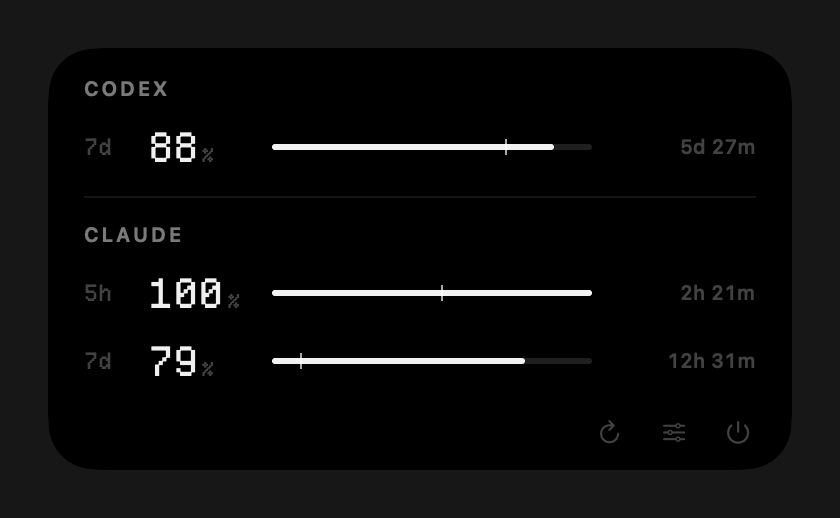
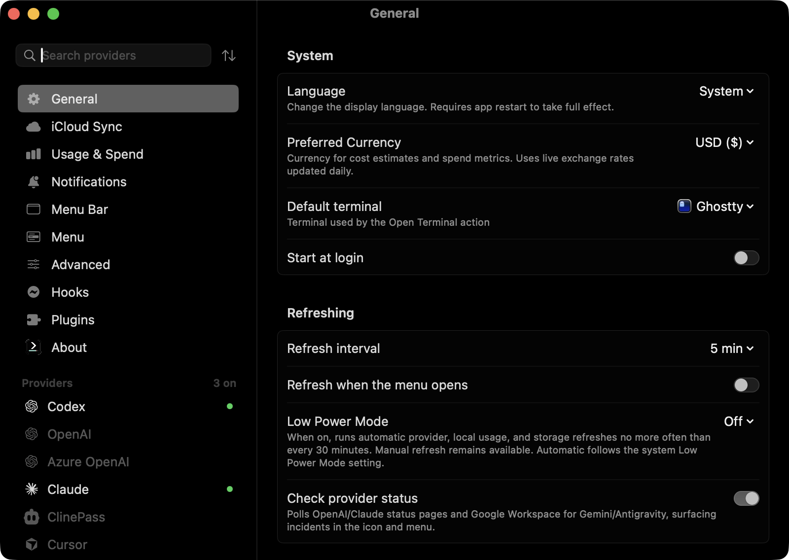

# CodexBar Glance

A fork of [CodexBar](https://github.com/steipete/CodexBar) that shows your Codex and Claude limits in the MacBook notch. It uses CodexBar's code for fetching and parsing usage unchanged, replaces the UI, and pulls in upstream updates on its own.

<p align="center"></p>

Collapsed, each side of the notch shows one provider: a ring and the percent left on whichever limit will run out first. Hover the notch and it opens into the full card:

<p align="center"></p>

## What's different from CodexBar

- **It lives in the notch.** Hover to open, move away to close. Macs without a notch get the same card from a menu bar item.
- **Every limit gets the same row.** A row is the window length (`5h`, `7d`), percent left, a bar, and time until reset. Rows go shortest window first and line up across providers, so you can read straight down a column. Claude shows both its 5-hour and 7-day limits; Codex shows its 7-day limit.
- **The tick on each bar is your pace.** It marks where steady use would leave you right now. If the bar ends left of the tick, you're using that limit faster than it refills.
- **Color only when it matters.** Everything is white until a limit gets low: amber below 25% (or below 50% while ahead of pace), red below 10%.
- **Details stay in Settings.** The card is for a quick look. Credits, cost history, accounts, and source options live in Settings, which uses the same black palette, monochrome sidebar, and limit rows.
- **It uses much less memory.** See below.
- **It keeps itself up to date.** See below.

<p align="center"></p>

## Memory

Measured on a Mac with about 17 GB of local Codex and Claude logs, which CodexBar scans for cost history:

| | Upstream CodexBar 0.68 | Glance |
|---|---|---|
| Idle, after startup | 481 MB | 113 MB |
| Idle, cost history turned off | – | 29 MB |

Almost all of CodexBar's memory goes to cost history. Glance scans it at launch and then at most once a day instead of on every refresh. After each scan it drops the decoded history, which reloads from CodexBar's cache on disk next time. The scan itself still spikes to a few hundred MB while it runs; that now happens about once a day.

## How it works

- **Same numbers as CodexBar.** The card is built from the same data CodexBar uses for its menu, so the two can't disagree. It redraws only when that data changes, plus once a minute for the reset countdowns. Glance never fetches anything itself.
- **New code sits in one folder.** The UI lives in [`Sources/CodexBar/Glance/`](../Sources/CodexBar/Glance). Only [`GlanceUpstreamBridge.swift`](../Sources/CodexBar/Glance/GlanceUpstreamBridge.swift) touches CodexBar's app code, so if an upstream change breaks the build, that's the file to fix.
- **Upstream files get small, marked edits.** One hides the old menu bar icons, one starts the glance controller, one lets the cost scan run less often, one frees the cost cache, and a few hook the Settings theme. Everything else is upstream as-is.
- **SwiftUI inside AppKit panels.** The notch is a floating panel sized to the display's notch. Numbers use [Departure Mono](https://departuremono.com).

## Install

Needs macOS 14+ and Xcode with Swift 6.2 or newer.

```sh
brew uninstall --cask codexbar   # if you have it; otherwise brew upgrade overwrites the fork
git clone -b glance https://github.com/sdrshn-nmbr/CodexBar.git
cd CodexBar
./Scripts/glance/make-signing-identity.sh   # once; asks for your Mac password
./Scripts/glance/install-agent.sh
launchctl kickstart gui/$(id -u)/com.sdrshn.codexbar-glance-sync
```

The signing script makes a local certificate so every build has the same signature. Without it, macOS treats each update as a new app and asks for permissions again.

The first run clones a separate copy into `~/Library/Application Support/CodexBarGlance/src`, builds it, signs it, and installs `/Applications/CodexBar.app`. A clean build takes about 15 minutes; later updates take a few. Open the app when it's done. It keeps your existing CodexBar settings.

## Updates

A LaunchAgent runs [`Scripts/glance/sync.sh`](../Scripts/glance/sync.sh) at 9:30, 15:30, and 21:30 when the Mac is plugged in, and catches up after sleep. Each run:

1. Rebases the `glance` branch onto upstream `main`.
2. Builds and runs the glance tests.
3. Packages the app, signs it with the local certificate, and swaps it into `/Applications`.
4. Pushes the rebased branch to this fork.

If any step fails, you keep the app you have and get a notification. Logs are in `~/Library/Application Support/CodexBarGlance/`. To update right now:

```sh
launchctl kickstart gui/$(id -u)/com.sdrshn.codexbar-glance-sync
```

If you work in your own clone, run `git pull --rebase` after a sync, since the branch gets rebased.

## Known limits

- Builds use a local certificate, not an Apple Developer ID, so the app runs only on Macs that trust that certificate. That's fine for your own machines; sharing builds with others would need a Developer ID.
- If Claude's numbers never update, set its source to CLI in Settings. When Claude Code's Keychain entry only holds MCP logins, CodexBar's automatic mode keeps showing the last saved numbers; the glance marks those with their age.
- Settings section headings still use the stock macOS style. Restyling them means editing every Settings page, which would make upstream rebases conflict.

## Credits

[CodexBar](https://github.com/steipete/CodexBar) by Peter Steinberger (MIT) does all the real work: providers, auth, fetching, parsing, and cost history. [Departure Mono](https://departuremono.com) is by Helena Zhang (SIL OFL 1.1). The notch window approach follows [NotchDrop](https://github.com/Lakr233/NotchDrop) (MIT).
